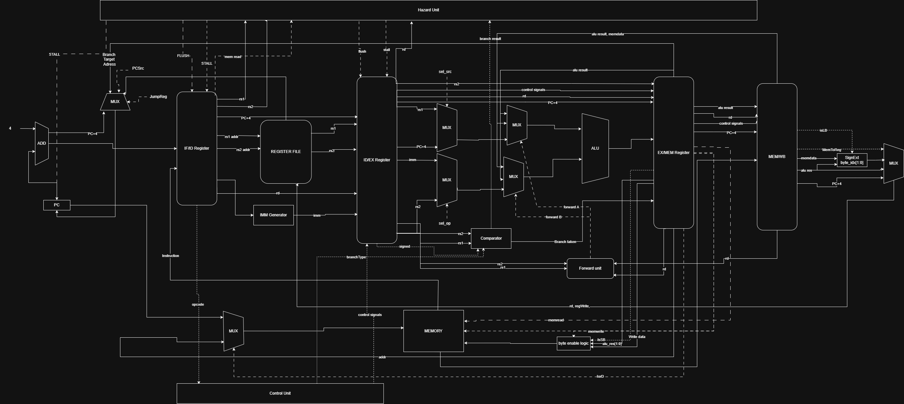

### risc pipeline scheme with processing of all hazards

- **Data Hazard (RAW) — Решается через FORWARDING (Проброс):**

  - **Как:** Блок `Forward Unit` (внизу) отслеживает данные в конвейерных регистрах `EX/MEM` и `MEM/WB`. Если следующая инструкция нуждается в данных, которые ещё не записаны в регистровый файл, они пробрасываются напрямую через MUX'ы на входы ALU.

  - **Результат:** Данные берутся напрямую из конвейера, минуя регистровый файл. Пузырей нет.

- **Load-Use Hazard (Чтение из памяти) — Решается через STALL (Задержка):**

  - **Как:** Блок `Hazard Detection Unit` (сверху) обнаруживает ситуацию, когда инструкция `lw` (загрузка) идёт непосредственно перед инструкцией, использующей загруженные данные. Он генерирует сигнал `STALL`, который замораживает конвейерные регистры `IF/ID` и `ID/EX`.

  - **Результат:** Конвейер замирает на 1 такт, давая данным время дойти из памяти до регистрового файла.

- **Control Hazard (Ветвление) — Решается через FLUSH (Очистка):**

  - **Как:** В стадии `EX` находится `Comparator` (сравнивает регистры для ветки) и формируется сигнал `Branch taken`. Если ветка берется, сигнал `FLUSH` очищает конвейерный регистр `IF/ID`, превращая неверно загруженную инструкцию в `NOP`.

  - **Результат:** Ненужные инструкции, которые успели залететь в конвейер, превращаются в `NOP` (пузыри) и не выполняются.